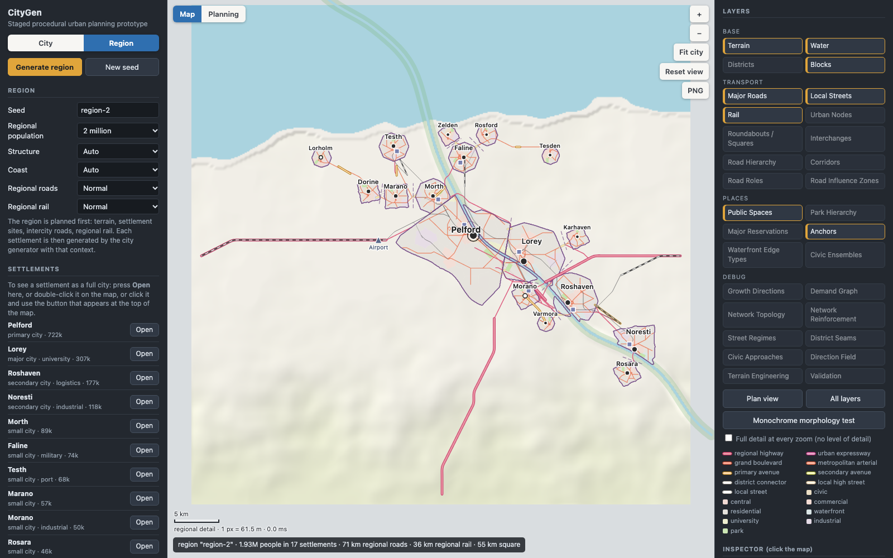

# ProceduralCityGen

A procedural city generator that plans a city the way a planner would: terrain first, then a brief,
regional structure, anchors and demand, and only then roads, districts, streets and blocks.
Roads are a consequence of the plan, not the starting point.

Plain JavaScript and Canvas. No dependencies, no build step.


It also generates **regions**: several settlements, each a full city of its own, sharing one
terrain and tied together by intercity roads and regional rail that are planned before any
settlement's streets.



## Quick start

Requires Node.js 18 or newer (only for the static file server and the headless tests).

```bash
git clone https://github.com/DanielPrecupas/ProceduralCityGen.git
cd ProceduralCityGen
npm start
```

Then open http://localhost:5173. To open straight into a region:
http://localhost:5173/?region=region-2&pop=2000000

```bash
npm run check   # headless run of three seeds: stage log, warnings, determinism
npm test        # regression checks: network, roundabouts, map interface, realism harness, Beta and regions
npm run realism # measure cities and compare them with real ones (see docs/REALISM.md)
```

## What it does

- **Staged pipeline.** Nineteen planning stages run in order over one `CityModel`. Any stage can be
  shown on its own, and the plan can be regenerated from any stage onward.
- **Deterministic.** The same seed and parameters always give the same city. Each stage has its own
  random stream (`seed + stage name`), so regenerating from a stage reproduces a full run exactly.
- **Explainable.** Every generated object carries `{ id, type, createdByStage, reason }`. Click
  anything on the map to see why it exists.
- **Demand-driven road network.** Major roads exist only where the demand graph between anchors asks
  for them, and are then reinforced where the network is measurably fragile.
- **Urban places, not just junctions.** Squares, civic circles, roundabouts, bridgeheads and
  interchanges are chosen by rule and reserved before streets are grown.
- **Readable morphology.** Districts differ in block size and street regime, so the function of an
  area can be read from its form alone (there is a monochrome view to test this).
- **Self-checking.** A validator reports specific, located warnings. There is deliberately no
  overall city score.
- **Measured against real cities.** The street network is profiled with the same code and the
  same metric schema as an OpenStreetMap extract, at city, district and neighbourhood scale, so
  realism can be compared in numbers rather than by eye ([docs/REALISM.md](docs/REALISM.md)). The
  first study, eight real cities against 96 generated ones, is in
  [docs/REALISM_CALIBRATION_REPORT.md](docs/REALISM_CALIBRATION_REPORT.md); the biases it found
  were then corrected and re-measured in [docs/REALISM_BETA_CHECK.md](docs/REALISM_BETA_CHECK.md).
- **Regions.** A regional population (700 thousand to 10 million) is shared out over settlements
  by a rank-size hierarchy, so one city usually dominates. Universities, hospitals, stadiums,
  station size and sub-centres are allocated by the region, not given to every town. Settlements
  may stay separate, nearly touch, or grow together: their streets are then joined selectively
  across the shared boundary while each keeps its own centre, street grid, growth pattern and
  administrative identity.

## Using the app

**Navigating**

- Drag to pan (the map glides on when released); scroll or pinch to zoom toward the cursor;
  double-click to zoom in. Keyboard: arrow keys or WASD pan, `+` / `-` zoom, `F` fits the city,
  `0` shows the whole map, `Esc` clears the selection.
- **Fit city** and **Reset view** are also buttons on the map, next to **PNG**, which saves the
  current view as an image.
- **Jump to a place** searches centres, the station, sub-centres, university, industry, port,
  major parks, institutions and named urban nodes, then flies there and selects it.
- The **minimap** shows the whole map and the current view; click or drag in it to move.
- A **scale bar** follows the zoom. None of this regenerates the city.

**Reading the map**

- **Map / Planning** switches between a cartographic style (pale land, cased roads coloured by
  hierarchy, muted land use) and the planning style (district colours, strong road classes).
  Every layer works in both.
- Detail follows the zoom. Far out: water, the built-up area and city boundary, R1/R2 roads, rail,
  main anchors and major parks. Mid zoom adds R3/R4 roads, district boundaries, urban nodes,
  institutions and waterfront edges. Close in: local streets, blocks, roundabout geometry, small
  parks and local labels. "Full detail at every zoom" turns this off.
- **Labels** are placed by priority (centre, station, sub-centres, university / industry / port,
  parks, nodes) and a label that would cover a more important one is left out.
- **Layers** are grouped as Base, Transport, Places and Debug; a group title toggles the group.
  "Plan view" and "All layers" are presets.
- **Monochrome morphology test** hides district colour, leaving roads, rail, parks, water, blocks and
  major anchors, always at full detail.
- **Reality Profile** (right panel) lists the plan's metrics at the chosen scale. Load one
  reference profile, or several to form a range, to see generated value, reference range and a
  diagnosis per metric. "Export city-profile.json" saves the profile for notebooks.
- New debug layers: Road Hierarchy, Corridors, District Seams, Civic Approaches.
- **Click** a road, rail line, node, district, park, reservation, block or anchor to inspect it: id,
  type, stage, reason and its metadata (tier, hierarchy, corridor, design role, morphology, ...). The inspector is
  read-only. Click a warning to jump to it.

**Regions**

- **City / Region** at the top of the left panel switches mode. In Region mode choose a regional
  population, a seed, a structure (dominant core, monocentric, polycentric, twin core, linear
  corridor, or auto), coast, and how dense the regional roads and rail are, then
  **Generate region**. City-only controls are hidden in this mode.
- The regional map shows settlement boundaries, centres, stations, regional highways and
  intercity roads, regional rail, protected land and the streets that cross shared boundaries. Zoomed out, most local
  streets are hidden; zoomed in, every settlement is drawn in full.
- **Click a settlement** to inspect its scale, role, population, planning profile, relationships
  with its neighbours, regional roads and rail, station, and the reason it is where it is.
  "Open in the city view" shows that settlement with every city layer and debug tool;
  "Back to the region" returns.

**Changing the plan**

- **Generate city** runs the whole pipeline; **New seed** picks another city.
- **Regenerate from stage** applies edited parameters from that stage onward (terrain changes need a
  full generate).
- **Drag an anchor** (station, civic centre, port, ...) and the plan is rebuilt from the demand graph
  onward with the anchor kept where you put it.
- An optional **heightmap image** replaces the procedural terrain (dark is low; below about 22% grey
  is water).

## Pipeline

Each stage reads the model left by earlier stages and adds to it.

| # | Stage | File | Adds to the model |
|---|-------|------|-------------------|
| 1 | Terrain | `planners/TerrainPlanner.js` | `terrain` rasters: elevation, slope, water, buildability, scenic, engineering `regime` |
| 2 | City brief | `planners/BriefPlanner.js` | `brief`: land need, scale, gesture budget (clamped to what the terrain can hold) |
| 3 | Regional structure | `planners/RegionalPlanner.js` | `regionalPlan`: core, founding extent, expansion reserve, growth directions, protected hills, gateways |
| 4 | Anchors | `planners/AnchorPlanner.js` | `anchors` with `tier`, `jobs`, `visitors`, `freight`, `civicPull`, `culturalPull` |
| 5 | Demand graph | `planners/DemandPlanner.js` | `demandGraph`: weighted links, road class, ceremonial flags |
| 6 | Major network | `planners/MajorNetworkPlanner.js` | `roads` R1–R4, `urbanGateways`, engineering candidates |
| 7 | Network reinforcement | `planners/NetworkReinforcementPlanner.js` | `reinforcement`: topology metrics before/after and the links added |
| 8 | Civic composition | `planners/CivicCompositionPlanner.js` | `civicComposition.gestures`, `civicEnsembles`, `reservations` (squares, civic garden) |
| 9 | Rail | `planners/RailPlanner.js` | `rail`: regional line through the station, freight spurs, metropolitan branch, stations |
| 10 | Urban nodes | `planners/JunctionPlanner.js` | `urbanNodes` (tier N1–N4, form), reserved circles / squares / plazas / interchange footprints |
| 11 | Districts | `planners/DistrictPlanner.js` | `districts` (block-size range, street regime), `districtGrid`, main-park reservation |
| 12 | Waterfront edges | `planners/WaterfrontPlanner.js` | `waterfront`: typed shoreline reaches, strips, esplanade where the edge is public |
| 13 | Road character | `planners/RoadCharacterPlanner.js` | `designRole` on R2/R3 roads, `roadInfluence` zones |
| 14 | Major reservations | `planners/MajorReservationPlanner.js` | `institutions` (hospital, stadium, rail yard, ...) with access roads |
| 15 | Local streets | `planners/StreetPlanner.js` | `field`, collectors + local streets, `network` (planar graph incl. rail), `railCrossings` |
| 16 | Blocks | `planners/BlockPlanner.js` | `blocks` from planar faces, sliver repair, pedestrian cuts in institutional blocks |
| 17 | Hierarchy and corridors | `planners/HierarchyPlanner.js` | `corridors`; `hierarchy` and `corridorId` on every edge and road; late `civicConflicts` |
| 18 | Public spaces | `planners/PublicSpacePlanner.js` | `publicSpaces` (park hierarchy, node places); `block.morphology` |
| 19 | Validation | `planners/Validator.js` | `validation.warnings` |

## Project layout

```
index.html
src/
  core/        CityModel, Pipeline, seeded RNG, geometry, rasters, planar RoadGraph, block presets
  algorithms/  least-cost routing, tensor field, streamline road growth, polygon and crossing helpers
  planners/    one file per pipeline stage
  region/      RegionGen (regional terrain, settlement system, sites, infrastructure, seam
               behaviour, settlement generation), SeamStitcher and PlanningProfiles
  analysis/    realism harness: Metrics (the shared schema), NetworkIO (GeoJSON / GraphML /
               network JSON readers), ReferenceCityAnalyzer, GeneratedCityAnalyzer, Compare
  rendering/   read-only over the model:
               MapRenderer (planning style, cached paths), MapStyle (cartographic style),
               Lod (what to draw at each zoom, width interpolation), LabelLayer (label
               priority and collision, jump list), DebugRenderer (stage layers)
  app/         main (app state, inspector, anchor dragging), viewport (pan / zoom animation),
               mapChrome (search, minimap, scale bar, export), controls (side panels)
scripts/
  serve.mjs              static server for npm start
  check.mjs              headless run and determinism check
  test-v21.mjs           network, node, reservation-access and rail checks
  test-roundabouts.mjs   roundabout geometry and eligibility checks
  test-v22.mjs           map interface: detail levels, widths, labels, jump list, model untouched
  test-v30a.mjs          realism harness, rail geometry, corridors, hierarchy, civic approaches, seams
  test-v30beta.mjs       junction topology, dead ends, avenue mesh, road systems, station complex, regions
  realism.mjs            profile generated cities, measure references, compare
tools/reference/         osmnx_to_reference.py: offline download of a real city for the harness
  calibration-batch.mjs  generate and measure a varied batch of cities
  calibration-report.mjs build the calibration data tables; calibration-plots.mjs the plots
reference/               corpus.json (cities and archetypes); profiles/ (measured real cities)
calibration/             citygen-batch.json (measured generated cities), summary.json
```

## How the main pieces work

### Roads and network

- **Major roads** are routed strongest-demand-first with A* (distance, grade, water and bridges,
  protected land, turn penalty). Travelling along an existing link is discounted, so weaker links
  merge into trunks instead of running in parallel.
- **Ceremonial alignments** (civic–station axis, diagonal, park vista) are tried as a straight line,
  then two straight legs meeting at under about 25°, then a controlled curve; otherwise they are
  demoted to ordinary arterials.
- **Urban transition.** A regional road is R1 only up to the first point properly inside the founding
  extent; from there it is R2, and the hand-over is recorded as an `urbanGateway`. The "Urban
  expressway" option keeps the station link R1.
- **Network reinforcement.** The R1–R3 network is analysed as a graph (articulation points, bridge
  edges, betweenness, detour ratios, river crossings, freight paths). A budgeted number of links is
  added, each for a measured reason: an extra bridge, a freight bypass, second access to a major
  centre, a direct link between centres, or a tangential between neighbouring outer districts.
- **Road roles** (`MOVEMENT_ARTERIAL`, `GRAND_BOULEVARD`, `COMMERCIAL_AVENUE`, `PARKWAY`,
  `WATERFRONT_BOULEVARD`, `CIVIC_AXIS`, `INDUSTRIAL_ARTERIAL`) are read from what a road runs
  through, and each role scales block spacing beside the road.

### Junctions and places

- **Urban nodes.** Every meeting of planned roads is scored into tiers N1–N4 and given a form by
  rule: interchanges only where an R1 is involved outside dense fabric, circles for many-armed civic
  meetings, squares at commercial and district centres, triangular plazas at acute forks,
  bridgeheads, and otherwise signalised or standard intersections. Strong roads that cross mid-road
  become real nodes unless one is explicitly grade-separated.
- **Roundabouts** come in three distinct kinds:
  - `MINI_ROUNDABOUT`: a small island on an ordinary crossing of two collector streets inside a
    residential or waterfront district. Nothing is reserved or reshaped.
  - `URBAN_ROUNDABOUT`: real geometry `{center, innerRadius, outerRadius, arms, splay}`. Arms stop at
    the outer radius and join the ring through curved connectors. Eligible only with 3–6 real arms,
    at least two R2/R3 roads, no R1 nearby, enough demand, and well-separated approaches.
  - `CIVIC_CIRCLE` / `GRAND_TRAFFIC_CIRCLE`: a place as well as a junction. Avenues arrive radially,
    close approaches are merged, and the circle grows to keep entries apart. Four or more approach
    groups, with no upper limit.

  There is no quota. Every roundabout must pass the same six geometry checks the validator reports;
  one that fails becomes a signalised junction or square, with `fallbackFrom` and `fallbackReason`
  recorded.
- **Rail crossings.** Collectors may cross the railway, local streets may not. Each crossing is
  classified `ROAD_OVER_RAIL`, `ROAD_UNDER_RAIL` or `LEVEL_CROSSING`.

### Civic structure, rail and reservations

- **Civic ensembles** group straight avenues, squares, the civic garden and vistas into one record
  (`CIVIC_TRIANGLE`, `RADIAL`, `RING_AND_AXIS`, `STATION_TO_CENTRE_AXIS`, `WATERFRONT_CIVIC_AXIS`).
- **Rail** is routed like roads but with a 2% grade target, a heavy turn penalty and a smoothing
  pass. It never runs through reserved civic squares or gardens and pays a penalty near the civic
  centre (`config.rail`).
- **Major reservations.** A programme chosen by city size (hospital, stadium, rail yard, ...) is
  sited by per-type scoring before streets are grown. Each gets a frame street and an access road;
  one that still cannot be reached after streets are grown is linked or removed.

### Districts, streets and blocks

- **Districts** grow from anchors by cost distance. Crossing an arterial, rail or water is expensive,
  so boundaries settle on them. Each district draws its block size from a per-type range and gets a
  dominant street regime.
- **Street regimes** (`ORTHOGONAL`, `WARPED_GRID`, `RADIAL_CIVIC`, `CONTOUR_FOLLOWING`, `WATERFRONT`,
  `STATION_DENSE`, `INDUSTRIAL_LARGE_BLOCK`) weight the basis fields of a tensor field; local streets
  are streamlines grown through it. Regular grids are the default.
- **Terrain regimes** (`NORMAL`, `MODERATE`, `STEEP`, `VERY_STEEP`, `SPECIAL_ENGINEERING`) change
  behaviour, not only cost: very steep ground forbids streets and makes arterials and rail tunnel
  candidates; steep ground allows switchbacks and forces contour-following streets.
- **Waterfront edges** (`PUBLIC_PROMENADE`, `PORT`, `INDUSTRIAL_QUAY`, `NATURAL_COAST`, `PARK_EDGE`,
  `BEACH`, `PROTECTED_EDGE`) are classified from what lies behind each shoreline reach.
- **Blocks** are faces of the planarised street graph. Slivers and dead stems are repaired by
  removing the offending local street. Every block carries `morphology` metadata (target size,
  frontage intent, courtyard potential, ...) for a future parcel stage.
- **Parks** form a hierarchy: metropolitan park and civic garden are reserved before streets;
  district parks go to large districts without one in reach; neighbourhood parks are placed where
  they bring the most unserved housing within 400 m; pocket greens use remnant blocks.

### V3.0 Beta: calibrated streets and regions

**Single-city corrections** (only what the calibration study confirmed; before and after in
[docs/REALISM_BETA_CHECK.md](docs/REALISM_BETA_CHECK.md)):

- **Junction topology.** Where a growing street meets another, it may `CROSS`, end there
  (`TERMINATE_AT_STREET`, a T-junction) or stop just beyond (`CUL_DE_SAC`). The choice depends on
  district type, distance from the centre, slope, shoreline, street regime and the brief
  (`JUNCTION_CONTEXT` in `planners/StreetPlanner.js`). Streets that end as a T leave the next
  block to be filled from other seeds, which gives staggered junctions.
- **Intended dead ends.** A street that stops short may be kept, with its cause recorded
  (`model.deadEnds`): railway, limited-access road, water, steep ground, park, reserved land,
  edge of the built-up area, a seam between two street patterns, or a deliberate cul-de-sac.
  They survive pruning and block repair and are not validator defects.
- **Avenue mesh.** Avenue lines are laid across the whole urban area at `avenueSpacing`
  (650 m by default) before collectors; the hierarchy stage promotes continuous chains until the
  city has about `2 × area / spacing` of avenue-or-better street. Major-road spacing no longer
  grows with city size.
- **Three road systems.** `ROAD_SYSTEMS` in `planners/HierarchyPlanner.js`: the street system
  (grand boulevard, metropolitan arterial, primary and secondary avenue, district connector, high
  street, local), the limited-access system (regional highway, urban expressway) and rail. A
  larger city gets an expressway joining two regional approaches around the core; grown streets
  neither start from it nor join it. `model.regionalRoadDecisions` records each regional road as
  `BYPASS`, `SKIRT`, `PASS_THROUGH_AS_EXPRESSWAY` or `TRANSITION_TO_URBAN_ARTERIAL`.
- **Variety.** Block spacing varies smoothly inside a district, independently for the two
  street directions; each district draws its own block proportion; residential blocks are longer.
  An ordinary flat district draws its regime from `ORTHOGONAL`, `WARPED_GRID` and
  `IRREGULAR_ORDERED` and may keep its own orientation.
- **Central station complex.** `model.rail.stationComplex`: a `THROUGH_STATION` or
  `TERMINAL_STATION` with 2–12 parallel platform tracks fanning out of the running lines, island
  platforms and a reserved yard. Larger cities get further main lines that merge tangentially
  into the approach, so several lines converge on one throat.

**RegionGen** (`src/region/RegionGen.js`): a `RegionModel` holds terrain, a regional plan,
settlements, regional roads and rail, seam connections, protected areas and statistics. CityGen is
reused unchanged as the settlement generator; each settlement is its own `CityModel`.

| Step | What it produces |
|---|---|
| 1. Regional terrain | one elevation function for the region (34–104 km square); each settlement's terrain is a window of it |
| 2. Regional plan | a population profile (`DOMINANT_CORE`, `MONOCENTRIC`, `POLYCENTRIC`, `TWIN_CORE`, `LINEAR_CORRIDOR`) and a rank-size list of settlements with a tail of towns: `rank`, `regionalImportance`, scale (`PRIMARY_CITY` … `LOCAL_TOWN`), unequal centre strength |
| 3. Sites | position, founding and growth boundary, influence radius, orientation, planning profile, role (`MIXED`, `INDUSTRIAL`, `PORT`, …), relation to neighbours |
| 4. Regional infrastructure | a road tree reaching every settlement plus direct links that pass a usefulness score, a main rail line with branches and freight corridors, port and airport anchors, protected land; then the regional allocation of institutions and each settlement's macro-growth pattern |
| 5. Seam behaviour | how open each shared boundary is: `POROUS`, `MODERATE`, `HARD` or `BARRIER`. This is behaviour, not a zone on the map |
| 6. Settlements | CityGen per settlement, given its terrain window, the boundary with each neighbour, where regional roads and rail arrive, and its role |
| 7. Stitching | regional lines end on the settlements' own gateways and rail portals; street ends facing a shared boundary are matched across it (`SeamStitcher.js`) |

- **Relations.** Two settlements are `SEPARATE`, `NEAR_TOUCHING` or `GLUED`; three or more glued
  together form a `CONTINUOUS_METROPOLITAN` group. Glued settlements are never merged: each
  builds only on its own side of the shared boundary, and keeps its centre, orientation, regime
  and `administrativeId`. `urbanContinuityGroup` and `metroRegionId` are stored separately.
- **Roads across a boundary** are handed over at the seam: both settlements get a gateway at the
  same point.
- **Streets across a boundary.** Avenues are matched first, then connectors, then a share of
  local streets set by the seam mode. A link is straight, a short curve, or a T-junction on the
  neighbour's first street; badly aligned streets are left apart and most local streets simply
  end at the old boundary. Each link records both settlements, both administrative ids, the
  class on each side and a `continuityReason`; avenues that meet form a cross-boundary corridor.
- **Hierarchy.** The primary city may be far larger than the rest (an internal 28 km `megacity`
  size holds up to 4.2 million). Institutions follow rank: the region works out demand for
  universities, hospitals, stadiums and cultural complexes and hands them down; stations are a
  hub, main station, simple station, halt or none; sub-centres run from none in a town to eight
  in the primary city.
- **Macro growth.** Each settlement has a `macroGrowthPattern` and `macroGrowthReason`
  (`CONCENTRIC`, `GRID_EXPANSION`, `RADIAL_CORRIDOR`, `MULTINODAL`, `ASYMMETRIC`,
  `BIDIRECTIONAL`, `LINEAR`) derived from coast, river, steep ground, regional roads, neighbours,
  size and planning profile. A city may stretch far along one axis only where its pattern or the
  terrain gives a reason.
- **Useful links only.** Reinforcement links inside a city and direct links between cities are
  scored (detour saved, demand, centre access, bottleneck relief, minus polygon-closing and empty
  runs). Rejected candidates are kept with a `rejectedReason`.
- **An opened settlement** shows its inherited values read-only; city controls cannot regenerate
  it in place.
- **A settlement a regional road runs through** decides for itself, in its own plan, whether
  that road bypasses, skirts or crosses it.

### V3.0 Alpha: realism calibration and transport structure

- **Reality profile.** `analysis/Metrics.js` turns any street network into a profile: intersection
  and street density, segment lengths, node degrees, 3-way / 4-way / dead-end shares, circuity,
  orientation entropy and order, number of grid orientations, road-class shares, major-road
  spacing, block area and aspect distributions, major-corridor continuity. A generated plan and a
  real city go through the same function. Results are reported per scale (whole city, 6 km
  windows, 1.5 km windows) and compared metric by metric against a reference city or a range from
  several; the outcome is a list of diagnostics such as "TOO SPARSE", never a score.
- **Hierarchy.** Every street has a level (Beta: nine, in two road systems; see above). The
  middle is filled by promoting streets that already exist: long collectors between major roads,
  long through-streets linking higher roads (kept apart from parallel ones), and the street
  through each neighbourhood centre. Each level, with those above it, must be one connected
  network; fragments are demoted.
- **Corridors.** Road sections that continue one another through junctions with little change of
  direction are chained into `Corridor` records (`segments`, `hierarchy`, `designRole`,
  `continuityScore`, `dominantBearing`, `length`, `reason`). A corridor may carry on across a
  square, circle or roundabout that interrupts it.
- **Transport profiles** (`core/TransportProfiles.js`): regional highway, urban expressway,
  metropolitan arterial, grand boulevard, parkway, intercity / regional / freight rail, each with
  a minimum radius, largest acceptable bend, grade sensitivity, access behaviour, continuity and
  frontage. Metro and tram are in the schema but not generated.
- **Rail alignment.** The routed path is fitted as a smoothing spline whose stiffness rises until
  the profile's minimum radius is met (`algorithms/Alignment.js`). Platforms of the central
  station stay on a straight; a branch is cut back and rejoins its host line along that line, so
  the turnout is tangential; the slow approach to a station or yard may use a tighter radius.
  Where terrain or reserved land prevents the radius, the line says so and the validator reports it.
- **Road alignment.** Arterial and regional chains are fitted the same way with their own radii.
  Straight and segmented formal alignments are left as designed; local streets keep hard corners.
- **Civic conflicts.** Every major road meeting a formal square has a recorded outcome:
  `TERMINATE_AXIS`, `SPLIT_AROUND` (traffic goes round on the frame street),
  `DOWNGRADE_TO_URBAN_BOULEVARD` (a regional road is stepped down before the square) or
  `PASS_ALONG_EDGE` (roads and rail beside parks, gardens and compounds). `REROUTE` is in the
  vocabulary; nothing currently needs it because rail routing already avoids reserved squares.
- **Square approaches.** Each formal square carries `approachGrammar`: perimeter, principal and
  secondary approaches, ceremonial axis, through-movement rule, frontage intent. Roads arrive at
  the middle of a side or at a corner; formal avenues keep their own axis through the centre.
- **District seams.** Each pair of neighbouring districts gets a boundary behaviour: `SOFT_BLEND`,
  `HARD_GRID_CHANGE`, `ARTERIAL_BOUNDARY`, `RAIL_BOUNDARY`, `GREEN_BOUNDARY`, `WATER_BOUNDARY`.
  Across a hard seam the two grids keep their own orientation up to the boundary instead of
  blending.
- **Valid imperfection.** Block repair now separates invalid geometry from blocks that are merely
  awkward. A triangle, wedge or small residual is kept when a major road, the railway, a formal
  frame or a hard seam explains it; it carries `form` and `imperfection.cause`.

### Map rendering

- **Geometry never changes for readability.** Only stroke widths, symbol sizes and label visibility
  depend on zoom. A road is drawn at a cartographic width interpolated between zoom stops, or at
  its physical width once that is larger.
- **Level of detail** is three bands on pixels-per-metre (`rendering/Lod.js`). Blocks and local
  streets are also bucketed into 1 km tiles, and only tiles on screen are drawn.
- **Labels** are drawn in screen space, greedily by priority, each trying a few positions around
  its symbol; area names wait until the area is larger than the name.

## Known simplifications

- **Terrain is a 50 m raster.** Shorelines and district outlines show stair-steps, most visibly
  when zoomed in close.
- **Roads have no names**, so there are no street labels; the far-zoom built-up fill uses the
  raster-traced district outlines. There is no tile engine and no SVG export.
- **Turn penalty in routing** uses the arrival direction of the best path per cell, not a full
  (cell × heading) state space.
- **Planarisation** splits at crossings and snaps nodes within 6 m; collinear overlaps are reported
  by the validator rather than merged.
- **District outlines** are traced from the raster and not snapped to road geometry.
- **Bridges, tunnels and viaducts** are metadata only (`road.engineering`).
- **Interchanges** are a footprint, a type and a symbol; ramps are not modelled.
- **Roundabouts** have ring and arm geometry but no lane-level detail.
- **Rail** is a smoothed centre line, not engineered track: no transition curves, cant or
  gradients profile, and some lines cannot meet their radius on difficult terrain.
- **Regions are a first version.** A settlement is capped at 4.2 million. Streets joined across
  a boundary are regional objects drawn in Region view; an opened settlement's own city view
  does not show them, and some touching pairs still have a gap with no connection. A primary
  city has one large station, not several. The regional terrain is smooth (250 m cells), regional roads and rail
  between settlements are simple fitted lines, and a settlement's own road and rail network is
  not re-planned after its neighbours exist.
- **The station complex is drawn, not operated:** tracks are not part of the street graph, there
  are no switches, and branch lines join the main line outside the throat.
- **Expressways have no ramps.** An expressway meets arterials at grade-separated crossings or
  at an interchange symbol; local streets are simply kept off it.
- **Hierarchy promotion is classification.** A promoted street is drawn and counted as a connector
  but is still the street that was grown; it is not widened or straightened.
- **Hard seams** change the direction field; streets crossing one bend rather than stop at it.
- **Square approach rules** apply to the squares of the civic composition, not yet to squares
  created at ordinary junctions.
- **Block presets** only scale block dimensions today; the other fields are passed through.
- **Thresholds** (node tier scores, place-form caps, reinforcement budget) are hand-tuned constants.

## Out of scope

Parcels, buildings, façades, 3D, traffic simulation, utilities, historical growth, economics,
metro and tram are not implemented. Locked roads, user-drawn axes and edited districts are not implemented
either; the hooks for them are `anchor.userMoved`, `reservations` and the per-stage reset in
`core/Pipeline.js`.

## References

- Chen, Esch, Wonka, Müller, Zhang. *Interactive Procedural Street Modeling.* SIGGRAPH 2008 (tensor
  fields for street networks).
- Parish, Müller. *Procedural Modeling of Cities.* SIGGRAPH 2001 (road growth with local constraints).
