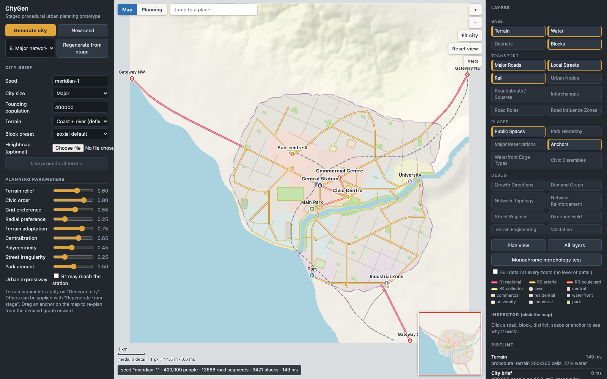

# ProceduralCityGen

A procedural city generator that plans a city the way a planner would: terrain first, then a brief,
regional structure, anchors and demand, and only then roads, districts, streets and blocks.
Roads are a consequence of the plan, not the starting point.

Plain JavaScript and Canvas. No dependencies, no build step.



## Quick start

Requires Node.js 18 or newer (only for the static file server and the headless tests).

```bash
git clone https://github.com/DanielPrecupas/ProceduralCityGen.git
cd ProceduralCityGen
npm start
```

Then open http://localhost:5173.

```bash
npm run check   # headless run of three seeds: stage log, warnings, determinism
npm test        # regression checks: network and nodes, roundabouts, map interface
```

## What it does

- **Staged pipeline.** Eighteen planning stages run in order over one `CityModel`. Any stage can be
  shown on its own, and the plan can be regenerated from any stage onward.
- **Deterministic.** The same seed and parameters always give the same city. Each stage has its own
  random stream (`seed + stage name`), so regenerating from a stage reproduces a full run exactly.
- **Explainable.** Every generated object carries `{ id, type, createdByStage, reason }`. Click
  anything on the map to see why it exists.
- **Demand-driven road network.** Major roads exist only where the demand graph between anchors asks
  for them, and are then reinforced where the network is measurably fragile.
- **Urban places, not just junctions.** Squares, civic circles, roundabouts, bridgeheads and
  interchanges are chosen by rule and reserved before streets are grown.
- **Readable morphology.** Districts differ in block size and street regime, so the function of an
  area can be read from its form alone (there is a monochrome view to test this).
- **Self-checking.** A validator reports specific, located warnings. There is deliberately no
  overall city score.

## Using the app

**Navigating**

- Drag to pan (the map glides on when released); scroll or pinch to zoom toward the cursor;
  double-click to zoom in. Keyboard: arrow keys or WASD pan, `+` / `-` zoom, `F` fits the city,
  `0` shows the whole map, `Esc` clears the selection.
- **Fit city** and **Reset view** are also buttons on the map, next to **PNG**, which saves the
  current view as an image.
- **Jump to a place** searches centres, the station, sub-centres, university, industry, port,
  major parks, institutions and named urban nodes, then flies there and selects it.
- The **minimap** shows the whole map and the current view; click or drag in it to move.
- A **scale bar** follows the zoom. None of this regenerates the city.

**Reading the map**

- **Map / Planning** switches between a cartographic style (pale land, cased roads coloured by
  hierarchy, muted land use) and the planning style (district colours, strong road classes).
  Every layer works in both.
- Detail follows the zoom. Far out: water, the built-up area and city boundary, R1/R2 roads, rail,
  main anchors and major parks. Mid zoom adds R3/R4 roads, district boundaries, urban nodes,
  institutions and waterfront edges. Close in: local streets, blocks, roundabout geometry, small
  parks and local labels. "Full detail at every zoom" turns this off.
- **Labels** are placed by priority (centre, station, sub-centres, university / industry / port,
  parks, nodes) and a label that would cover a more important one is left out.
- **Layers** are grouped as Base, Transport, Places and Debug; a group title toggles the group.
  "Plan view" and "All layers" are presets.
- **Monochrome morphology test** hides district colour, leaving roads, rail, parks, water, blocks and
  major anchors, always at full detail.
- **Click** a road, rail line, node, district, park, reservation, block or anchor to inspect it: id,
  type, stage, reason and its metadata (tier, design role, morphology, ...). The inspector is
  read-only. Click a warning to jump to it.

**Changing the plan**

- **Generate city** runs the whole pipeline; **New seed** picks another city.
- **Regenerate from stage** applies edited parameters from that stage onward (terrain changes need a
  full generate).
- **Drag an anchor** (station, civic centre, port, ...) and the plan is rebuilt from the demand graph
  onward with the anchor kept where you put it.
- An optional **heightmap image** replaces the procedural terrain (dark is low; below about 22% grey
  is water).

## Pipeline

Each stage reads the model left by earlier stages and adds to it.

| # | Stage | File | Adds to the model |
|---|-------|------|-------------------|
| 1 | Terrain | `planners/TerrainPlanner.js` | `terrain` rasters: elevation, slope, water, buildability, scenic, engineering `regime` |
| 2 | City brief | `planners/BriefPlanner.js` | `brief`: land need, scale, gesture budget (clamped to what the terrain can hold) |
| 3 | Regional structure | `planners/RegionalPlanner.js` | `regionalPlan`: core, founding extent, expansion reserve, growth directions, protected hills, gateways |
| 4 | Anchors | `planners/AnchorPlanner.js` | `anchors` with `tier`, `jobs`, `visitors`, `freight`, `civicPull`, `culturalPull` |
| 5 | Demand graph | `planners/DemandPlanner.js` | `demandGraph`: weighted links, road class, ceremonial flags |
| 6 | Major network | `planners/MajorNetworkPlanner.js` | `roads` R1–R4, `urbanGateways`, engineering candidates |
| 7 | Network reinforcement | `planners/NetworkReinforcementPlanner.js` | `reinforcement`: topology metrics before/after and the links added |
| 8 | Civic composition | `planners/CivicCompositionPlanner.js` | `civicComposition.gestures`, `civicEnsembles`, `reservations` (squares, civic garden) |
| 9 | Rail | `planners/RailPlanner.js` | `rail`: regional line through the station, freight spurs, metropolitan branch, stations |
| 10 | Urban nodes | `planners/JunctionPlanner.js` | `urbanNodes` (tier N1–N4, form), reserved circles / squares / plazas / interchange footprints |
| 11 | Districts | `planners/DistrictPlanner.js` | `districts` (block-size range, street regime), `districtGrid`, main-park reservation |
| 12 | Waterfront edges | `planners/WaterfrontPlanner.js` | `waterfront`: typed shoreline reaches, strips, esplanade where the edge is public |
| 13 | Road character | `planners/RoadCharacterPlanner.js` | `designRole` on R2/R3 roads, `roadInfluence` zones |
| 14 | Major reservations | `planners/MajorReservationPlanner.js` | `institutions` (hospital, stadium, rail yard, ...) with access roads |
| 15 | Local streets | `planners/StreetPlanner.js` | `field`, collectors + local streets, `network` (planar graph incl. rail), `railCrossings` |
| 16 | Blocks | `planners/BlockPlanner.js` | `blocks` from planar faces, sliver repair, pedestrian cuts in institutional blocks |
| 17 | Public spaces | `planners/PublicSpacePlanner.js` | `publicSpaces` (park hierarchy, node places); `block.morphology` |
| 18 | Validation | `planners/Validator.js` | `validation.warnings` |

## Project layout

```
index.html
src/
  core/        CityModel, Pipeline, seeded RNG, geometry, rasters, planar RoadGraph, block presets
  algorithms/  least-cost routing, tensor field, streamline road growth, polygon and crossing helpers
  planners/    one file per pipeline stage
  rendering/   read-only over the model:
               MapRenderer (planning style, cached paths), MapStyle (cartographic style),
               Lod (what to draw at each zoom, width interpolation), LabelLayer (label
               priority and collision, jump list), DebugRenderer (stage layers)
  app/         main (app state, inspector, anchor dragging), viewport (pan / zoom animation),
               mapChrome (search, minimap, scale bar, export), controls (side panels)
scripts/
  serve.mjs              static server for npm start
  check.mjs              headless run and determinism check
  test-v21.mjs           network, node, reservation-access and rail checks
  test-roundabouts.mjs   roundabout geometry and eligibility checks
  test-v22.mjs           map interface: detail levels, widths, labels, jump list, model untouched
```

## How the main pieces work

### Roads and network

- **Major roads** are routed strongest-demand-first with A* (distance, grade, water and bridges,
  protected land, turn penalty). Travelling along an existing link is discounted, so weaker links
  merge into trunks instead of running in parallel.
- **Ceremonial alignments** (civic–station axis, diagonal, park vista) are tried as a straight line,
  then two straight legs meeting at under about 25°, then a controlled curve; otherwise they are
  demoted to ordinary arterials.
- **Urban transition.** A regional road is R1 only up to the first point properly inside the founding
  extent; from there it is R2, and the hand-over is recorded as an `urbanGateway`. The "Urban
  expressway" option keeps the station link R1.
- **Network reinforcement.** The R1–R3 network is analysed as a graph (articulation points, bridge
  edges, betweenness, detour ratios, river crossings, freight paths). A budgeted number of links is
  added, each for a measured reason: an extra bridge, a freight bypass, second access to a major
  centre, a direct link between centres, or a tangential between neighbouring outer districts.
- **Road roles** (`MOVEMENT_ARTERIAL`, `GRAND_BOULEVARD`, `COMMERCIAL_AVENUE`, `PARKWAY`,
  `WATERFRONT_BOULEVARD`, `CIVIC_AXIS`, `INDUSTRIAL_ARTERIAL`) are read from what a road runs
  through, and each role scales block spacing beside the road.

### Junctions and places

- **Urban nodes.** Every meeting of planned roads is scored into tiers N1–N4 and given a form by
  rule: interchanges only where an R1 is involved outside dense fabric, circles for many-armed civic
  meetings, squares at commercial and district centres, triangular plazas at acute forks,
  bridgeheads, and otherwise signalised or standard intersections. Strong roads that cross mid-road
  become real nodes unless one is explicitly grade-separated.
- **Roundabouts** come in three distinct kinds:
  - `MINI_ROUNDABOUT`: a small island on an ordinary crossing of two collector streets inside a
    residential or waterfront district. Nothing is reserved or reshaped.
  - `URBAN_ROUNDABOUT`: real geometry `{center, innerRadius, outerRadius, arms, splay}`. Arms stop at
    the outer radius and join the ring through curved connectors. Eligible only with 3–6 real arms,
    at least two R2/R3 roads, no R1 nearby, enough demand, and well-separated approaches.
  - `CIVIC_CIRCLE` / `GRAND_TRAFFIC_CIRCLE`: a place as well as a junction. Avenues arrive radially,
    close approaches are merged, and the circle grows to keep entries apart. Four or more approach
    groups, with no upper limit.

  There is no quota. Every roundabout must pass the same six geometry checks the validator reports;
  one that fails becomes a signalised junction or square, with `fallbackFrom` and `fallbackReason`
  recorded.
- **Rail crossings.** Collectors may cross the railway, local streets may not. Each crossing is
  classified `ROAD_OVER_RAIL`, `ROAD_UNDER_RAIL` or `LEVEL_CROSSING`.

### Civic structure, rail and reservations

- **Civic ensembles** group straight avenues, squares, the civic garden and vistas into one record
  (`CIVIC_TRIANGLE`, `RADIAL`, `RING_AND_AXIS`, `STATION_TO_CENTRE_AXIS`, `WATERFRONT_CIVIC_AXIS`).
- **Rail** is routed like roads but with a 2% grade target, a heavy turn penalty and a smoothing
  pass. It never runs through reserved civic squares or gardens and pays a penalty near the civic
  centre (`config.rail`).
- **Major reservations.** A programme chosen by city size (hospital, stadium, rail yard, ...) is
  sited by per-type scoring before streets are grown. Each gets a frame street and an access road;
  one that still cannot be reached after streets are grown is linked or removed.

### Districts, streets and blocks

- **Districts** grow from anchors by cost distance. Crossing an arterial, rail or water is expensive,
  so boundaries settle on them. Each district draws its block size from a per-type range and gets a
  dominant street regime.
- **Street regimes** (`ORTHOGONAL`, `WARPED_GRID`, `RADIAL_CIVIC`, `CONTOUR_FOLLOWING`, `WATERFRONT`,
  `STATION_DENSE`, `INDUSTRIAL_LARGE_BLOCK`) weight the basis fields of a tensor field; local streets
  are streamlines grown through it. Regular grids are the default.
- **Terrain regimes** (`NORMAL`, `MODERATE`, `STEEP`, `VERY_STEEP`, `SPECIAL_ENGINEERING`) change
  behaviour, not only cost: very steep ground forbids streets and makes arterials and rail tunnel
  candidates; steep ground allows switchbacks and forces contour-following streets.
- **Waterfront edges** (`PUBLIC_PROMENADE`, `PORT`, `INDUSTRIAL_QUAY`, `NATURAL_COAST`, `PARK_EDGE`,
  `BEACH`, `PROTECTED_EDGE`) are classified from what lies behind each shoreline reach.
- **Blocks** are faces of the planarised street graph. Slivers and dead stems are repaired by
  removing the offending local street. Every block carries `morphology` metadata (target size,
  frontage intent, courtyard potential, ...) for a future parcel stage.
- **Parks** form a hierarchy: metropolitan park and civic garden are reserved before streets;
  district parks go to large districts without one in reach; neighbourhood parks are placed where
  they bring the most unserved housing within 400 m; pocket greens use remnant blocks.

### Map rendering

- **Geometry never changes for readability.** Only stroke widths, symbol sizes and label visibility
  depend on zoom. A road is drawn at a cartographic width interpolated between zoom stops, or at
  its physical width once that is larger.
- **Level of detail** is three bands on pixels-per-metre (`rendering/Lod.js`). Blocks and local
  streets are also bucketed into 1 km tiles, and only tiles on screen are drawn.
- **Labels** are drawn in screen space, greedily by priority, each trying a few positions around
  its symbol; area names wait until the area is larger than the name.

## Known simplifications

- **Terrain is a 50 m raster.** Shorelines and district outlines show stair-steps, most visibly
  when zoomed in close.
- **Roads have no names**, so there are no street labels; the far-zoom built-up fill uses the
  raster-traced district outlines. There is no tile engine and no SVG export.
- **Turn penalty in routing** uses the arrival direction of the best path per cell, not a full
  (cell × heading) state space.
- **Planarisation** splits at crossings and snaps nodes within 6 m; collinear overlaps are reported
  by the validator rather than merged.
- **District outlines** are traced from the raster and not snapped to road geometry.
- **Bridges, tunnels and viaducts** are metadata only (`road.engineering`).
- **Interchanges** are a footprint, a type and a symbol; ramps are not modelled.
- **Roundabouts** have ring and arm geometry but no lane-level detail.
- **Rail junctions** are not tangential: spurs join where the least-cost path arrives.
- **Block presets** only scale block dimensions today; the other fields are passed through.
- **Thresholds** (node tier scores, place-form caps, reinforcement budget) are hand-tuned constants.

## Out of scope

Parcels, buildings, façades, 3D, traffic simulation, utilities, historical growth, economics and
export are not implemented. Locked roads, user-drawn axes and edited districts are not implemented
either; the hooks for them are `anchor.userMoved`, `reservations` and the per-stage reset in
`core/Pipeline.js`.

## References

- Chen, Esch, Wonka, Müller, Zhang. *Interactive Procedural Street Modeling.* SIGGRAPH 2008 (tensor
  fields for street networks).
- Parish, Müller. *Procedural Modeling of Cities.* SIGGRAPH 2001 (road growth with local constraints).
