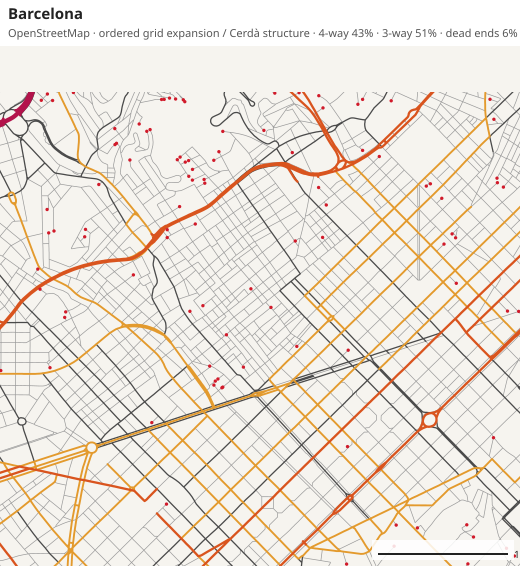
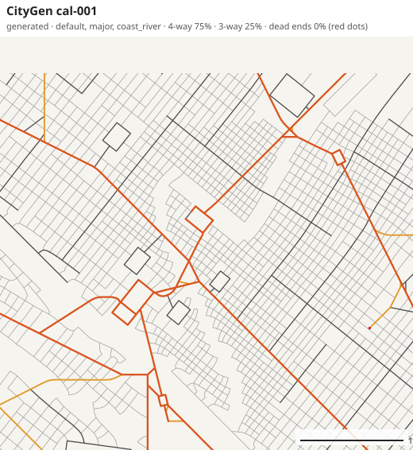
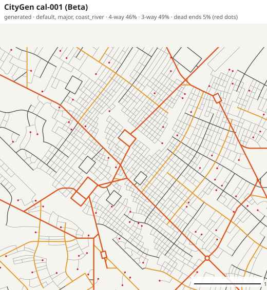
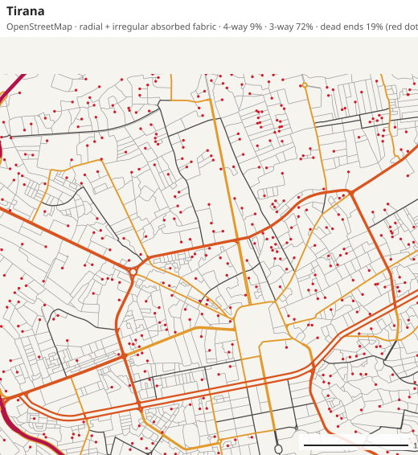
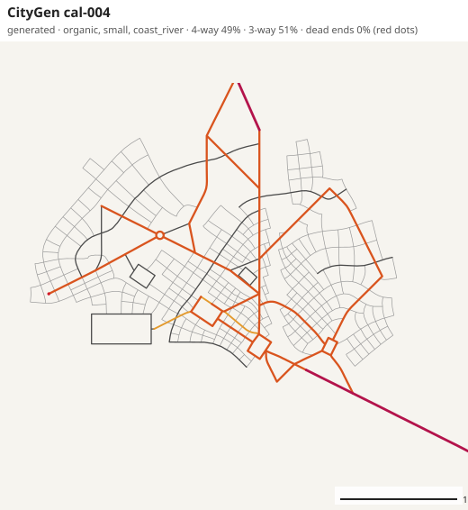
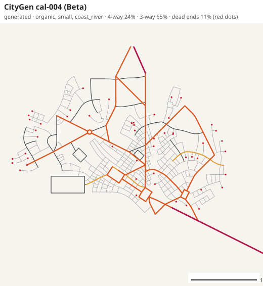

# Realism check after the Beta calibration fixes

The same study as [REALISM_CALIBRATION_REPORT.md](REALISM_CALIBRATION_REPORT.md), rerun on the
V3.0 Beta generator: the same 96 batch configurations (`cal-001` to `cal-096`), the same eight
reference cities, the same metric code. "Before" is the Alpha.2 generator. Tables are produced by
`node scripts/calibration-compare.mjs calibration/summary-alpha2.json calibration/summary.json`;
the full Beta tables are in [calibration/DATA_TABLES_CURRENT.md](calibration/DATA_TABLES_CURRENT.md).

The aim was not to hit reference medians. It was to move the four confirmed biases into real
ranges without pushing out the metrics that were already realistic. There is still no overall
score.

## Summary

| Confirmed bias | Before | After | Reference |
|---|---|---|---|
| 1. Streets cross instead of ending: 4-way share | 68% | 34% | 6–39% |
| 1. Dead ends | 0.2% | 9.4% | 5.6–25.3% |
| 2. Avenue tier | 1.7% of length | 9.6% | 5.2–14.0% |
| 2. Major-road spacing | 1222 m (1374 m for the largest size) | 717 m (723 m for the largest size) | 374–840 m in seven of eight |
| 3. Block aspect ratio (≥ 0.3 ha) | 1.45 | 1.73 | 1.57–2.02 |
| 3. Segment-length spread (P75/P25) | 1.77 | 2.32 | 2.24–5.63 |
| 4. Strong-grid neighbourhoods | 72% | 49% | 2–24% outside Denver, 87% in Denver |

- At city scale all 26 metrics now have their median inside the envelope of the eight
  reference cities. In Alpha.2, ten did not.
- The metrics that were already realistic stayed realistic: intersection density 77 → 65 /km²
  (reference 30–114, median 67), street density 14.8 → 12.2 km/km² (9.4–16.7, median 12.8),
  median segment 88 → 75 m (54–127, median 75), median block 0.90 → 0.78 ha (0.53–2.60,
  median 0.95). They moved by 12–18%, towards the reference medians in three cases and away in
  one (block area).
- Corridor continuity was not targeted and its definition was not changed: 0.54 → 0.59.
- Major-road spacing no longer grows with city size (small 655 m, medium 718 m, major 723 m).

## What is still off

- **Still at the grid end.** The 4-way share (34%) and orientation order (0.38 city-wide, 0.59
  in the median neighbourhood) are inside the envelope but above seven of the eight cities;
  only Denver is higher. Half of the neighbourhood windows are still strong grids. The default
  brief is now a loosened grid city, not yet a typical European one.
- **Almost no truly irregular fabric.** 2% of neighbourhood windows are irregular, against
  7–39% in seven cities. The new `IRREGULAR_ORDERED` regime bends a grid; it does not produce
  the organic fabric of an old core or an informally grown district.
- **3-way share at neighbourhood scale** is 57%, level with the lowest reference city (57–76%).
- **Dead ends are at the low end** for every archetype except compact and grid cities
  (9.4% against 17–25% in fragmented, automotive and informally grown cities). That is by
  design for the default brief; no profile yet produces the high-dead-end fabric.
- **Regional roads inside the city** rose from 2.1% to 4.2% of length (reference 2.5–14.0%,
  median 7.4%): one bypass per larger city is still less than real cities have.

## What changed in the generator

1. **Junction topology.** Where a growing street reaches another, a context-dependent decision
   is taken: cross, end there as a T, or end a short way beyond as a cul-de-sac. A street
   seeded on an existing street may leave it to one side only. Context is district type,
   distance from the centre, slope, shoreline, street regime and the brief.
2. **Intended dead ends.** A street that stops short of a junction may be kept, with its cause
   recorded (railway, limited-access road, water, steep ground, park, reserved land, edge of the
   built-up area, seam between two street patterns, deliberate cul-de-sac). They survive pruning
   and block repair, and the validator no longer reports them as defects.
3. **Avenue mesh.** Avenue lines are laid over the whole urban area before collectors, at a
   spacing set by `avenueSpacing` (650 m by default); the hierarchy stage then promotes as many
   continuous chains as the urban area calls for (about 2 × area / spacing).
4. **Road systems.** Street system, limited-access system and rail are separate. Larger cities
   get an expressway linking two regional approaches around the core; grown streets neither
   start from nor join it. Each regional road's behaviour is recorded.
5. **Variety.** Block spacing varies smoothly within a district, independently for the two
   street directions; each district draws its own block proportion; residential blocks are
   longer.
6. **Less grid by default.** An ordinary flat district draws its regime from `ORTHOGONAL`,
   `WARPED_GRID` and `IRREGULAR_ORDERED`, and may keep its own orientation.

## Tables

### City scale

| Metric | Reference low–high (median) | Before (median) | After P10 – median – P90 | In envelope before → after | Position after |
|---|---|---|---|---|---|
| 4-way intersections (%) | 6–39 (20) | 68 | 28 – **34** – 40 | 0% → 85% | inside; 7 of 8 below |
| 3-way intersections (%) | 52–75 (66) | 31 | 48 – **54** – 59 | 1% → 65% | inside; 1 of 8 below |
| Dead ends (%) | 5.6–25.3 (12.9) | 0.2 | 7.7 – **9.4** – 11.9 | 0% → 99% | inside; 4 of 8 below |
| Streets per node | 2.56–3.24 (2.92) | 3.67 | 3.00 – **3.13** – 3.22 | 0% → 93% | inside; 5 of 8 below |
| Avenue share (%) | 5.2–14.0 (8.2) | 1.7 | 3.1 – **9.6** – 12.8 | 0% → 75% | inside; 5 of 8 below |
| Connector share (the middle) (%) | 10.1–18.7 (12.6) | 11.6 | 11.2 – **14.0** – 16.1 | 72% → 94% | inside; 5 of 8 below |
| Local street share (%) | 49.0–71.6 (62.2) | 76.3 | 59.1 – **63.3** – 66.0 | 22% → 98% | inside; 5 of 8 below |
| Major road share (%) | 9.6–37.5 (24.7) | 11.2 | 20.3 – **22.9** – 26.9 | 68% → 98% | inside; 3 of 8 below |
| Regional road share (%) | 2.5–14.0 (7.4) | 2.1 | 2.7 – **4.2** – 7.4 | 40% → 97% | inside; 1 of 8 below |
| Major-road spacing (m) | 374–1777 (579) | 1222 | 644 – **717** – 761 | 100% → 100% | inside; 5 of 8 below |
| Orientation order | 0.01–0.81 (0.06) | 0.70 | 0.08 – **0.38** – 0.68 | 84% → 96% | inside; 7 of 8 below |
| Circuity | 1.030–1.084 (1.059) | 1.026 | 1.027 – **1.042** – 1.064 | 41% → 84% | inside; 2 of 8 below |
| Block aspect ratio (median) | 1.68–2.10 (1.87) | 1.45 | 1.56 – **1.70** – 1.84 | 0% → 59% | inside; 1 of 8 below |
| Intersection density (/km²) | 30–114 (67) | 77 | 56 – **65** – 74 | 100% → 99% | inside; 3 of 8 below |
| Street density (km/km²) | 9.4–16.7 (12.8) | 14.8 | 10.9 – **12.2** – 13.5 | 95% → 99% | inside; 4 of 8 below |
| Segment length (median) (m) | 54–127 (75) | 88 | 71 – **75** – 80 | 100% → 100% | inside; 4 of 8 below |
| Block area (median) (ha) | 0.53–2.60 (0.95) | 0.90 | 0.57 – **0.78** – 0.92 | 100% → 94% | inside; 2 of 8 below |
| Major-corridor continuity | 0.22–0.90 (0.33) | 0.54 | 0.48 – **0.59** – 0.84 | 93% → 96% | inside; 7 of 8 below |
| Major-corridor length (km) | 2.4–9.9 (3.3) | 2.9 | 2.0 – **3.4** – 4.6 | 75% → 76% | inside; 5 of 8 below |

### District scale

| Metric | Reference low–high (median) | Before (median) | After P10 – median – P90 | In envelope before → after | Position after |
|---|---|---|---|---|---|
| 4-way intersections (%) | 7–44 (20) | 72 | 29 – **39** – 45 | 0% → 90% | inside; 7 of 8 below |
| 3-way intersections (%) | 50–73 (66) | 27 | 47 – **52** – 58 | 0% → 79% | inside; 1 of 8 below |
| Dead ends (%) | 5.5–25.1 (12.0) | 0.1 | 5.7 – **7.6** – 11.0 | 0% → 98% | inside; 3 of 8 below |
| Streets per node | 2.56–3.32 (2.93) | 3.72 | 3.03 – **3.21** – 3.31 | 0% → 95% | inside; 7 of 8 below |
| Avenue share (%) | 3.8–14.1 (8.6) | 2.1 | 8.1 – **10.2** – 14.0 | 2% → 97% | inside; 6 of 8 below |
| Connector share (the middle) (%) | 9.6–20.7 (12.0) | 12.0 | 11.2 – **13.6** – 16.2 | 92% → 97% | inside; 5 of 8 below |
| Local street share (%) | 49.0–72.9 (61.8) | 78.7 | 61.4 – **65.9** – 69.4 | 2% → 98% | inside; 6 of 8 below |
| Major road share (%) | 7.2–38.1 (26.4) | 8.8 | 17.2 – **20.3** – 24.2 | 90% → 98% | inside; 1 of 8 below |
| Regional road share (%) | 0.0–13.8 (7.6) | 0.0 | 0.0 – **2.5** – 4.2 | 100% → 100% | inside; 1 of 8 below |
| Major-road spacing (m) | 409–2139 (535) | 1373 | 625 – **693** – 786 | 100% → 100% | inside; 5 of 8 below |
| Orientation order | 0.05–0.84 (0.09) | 0.73 | 0.10 – **0.42** – 0.65 | 81% → 94% | inside; 7 of 8 below |
| Circuity | 1.026–1.077 (1.048) | 1.020 | 1.024 – **1.036** – 1.049 | 19% → 82% | inside; 2 of 8 below |
| Block aspect ratio (median) | 1.63–2.12 (1.88) | 1.44 | 1.57 – **1.67** – 1.93 | 0% → 74% | inside; 1 of 8 below |
| Intersection density (/km²) | 28–128 (80) | 92 | 57 – **78** – 92 | 100% → 100% | inside; 4 of 8 below |
| Street density (km/km²) | 9.5–18.5 (13.7) | 16.8 | 12.0 – **14.1** – 15.9 | 94% → 98% | inside; 4 of 8 below |
| Segment length (median) (m) | 54–130 (75) | 86 | 70 – **73** – 89 | 100% → 100% | inside; 4 of 8 below |
| Block area (median) (ha) | 0.51–2.91 (0.87) | 0.86 | 0.60 – **0.70** – 1.21 | 100% → 100% | inside; 2 of 8 below |

### Neighbourhood scale

| Metric | Reference low–high (median) | Before (median) | After P10 – median – P90 | In envelope before → after | Position after |
|---|---|---|---|---|---|
| 4-way intersections (%) | 5–34 (17) | 68 | 14 – **27** – 49 | 0% → 74% | inside; 7 of 8 below |
| 3-way intersections (%) | 57–76 (66) | 31 | 44 – **57** – 67 | 0% → 44% | below all 8 (0.99x the lowest); 0 of 8 below |
| Dead ends (%) | 5.5–28.5 (12.6) | 0.0 | 3.1 – **10.0** – 18.1 | 0% → 99% | inside; 4 of 8 below |
| Streets per node | 2.47–3.19 (2.90) | 3.68 | 2.75 – **3.04** – 3.41 | 0% → 85% | inside; 5 of 8 below |
| Avenue share (%) | 0.3–13.3 (6.6) | 1.3 | 2.9 – **10.2** – 22.1 | 77% → 77% | inside; 7 of 8 below |
| Connector share (the middle) (%) | 8.7–19.0 (11.4) | 11.7 | 7.4 – **14.4** – 25.1 | 79% → 95% | inside; 6 of 8 below |
| Local street share (%) | 48.1–71.9 (63.4) | 77.9 | 47.1 – **64.5** – 75.6 | 9% → 97% | inside; 5 of 8 below |
| Major road share (%) | 5.7–37.3 (22.9) | 9.1 | 12.4 – **20.3** – 34.7 | 100% → 99% | inside; 2 of 8 below |
| Regional road share (%) | 0.0–6.3 (0.0) | 0.0 | 0.0 – **0.0** – 0.8 | 100% → 100% | inside; 0 of 8 below |
| Major-road spacing (m) | 433–1614 (617) | 1362 | 505 – **747** – 1235 | 88% → 100% | inside; 5 of 8 below |
| Orientation order | 0.19–0.89 (0.30) | 0.79 | 0.26 – **0.59** – 0.89 | 79% → 94% | inside; 7 of 8 below |
| Circuity | 1.026–1.068 (1.048) | 1.022 | 1.013 – **1.037** – 1.079 | 34% → 80% | inside; 2 of 8 below |
| Block aspect ratio (median) | 1.73–2.09 (1.90) | 1.46 | 1.49 – **1.81** – 2.50 | 0% → 59% | inside; 2 of 8 below |
| Intersection density (/km²) | 28–124 (60) | 79 | 32 – **60** – 138 | 100% → 99% | inside; 4 of 8 below |
| Street density (km/km²) | 9.2–17.8 (13.0) | 15.9 | 8.2 – **12.9** – 20.2 | 98% → 99% | inside; 4 of 8 below |
| Segment length (median) (m) | 54–136 (75) | 96 | 66 – **92** – 126 | 100% → 99% | inside; 6 of 8 below |
| Block area (median) (ha) | 0.56–3.01 (1.00) | 1.06 | 0.48 – **1.25** – 2.29 | 96% → 91% | inside; 6 of 8 below |

### Variety within a city

| Measure | Reference low–high | Before | After (P10–P90 of seeds) |
|---|---|---|---|
| Segment length P75/P25 | 2.24–5.63 | 1.77 | **2.32** (2.12–2.55) |
| Block area P75/P25 (≥ 0.3 ha) | 1.46–4.13 | 2.34 | **3.50** (2.84–4.24) |
| Block aspect ratio, median (≥ 0.3 ha) | 1.57–2.02 | 1.45 | **1.73** (1.58–1.89) |
| Block aspect ratio, 75th pct (≥ 0.3 ha) | 2.12–2.95 | 1.73 | **2.42** (2.04–2.75) |
| Strong-grid neighbourhood windows | 2–24% (Denver 87%) | 72% | **49%** |
| Irregular neighbourhood windows | 7–39% (Denver 0%) | 1% | **2%** |

### Differences between neighbourhoods of one city (must stay realistic)

| Measure | Reference low–high | Before | After |
|---|---|---|---|
| Intersection density P90/P10 | 2.0–8.7 | 2.79 | **3.88** |
| Median block area P90/P10 | 1.7–14.1 | 2.58 | **4.29** |
| Major-road share, P90 − P10 (points) | 19.0–50.1 | 10.36 | **19.57** |
| Dead-end share, P90 − P10 (points) | 6.6–31.4 | 0.50 | **13.97** |

### Junctions by position in the city (neighbourhood windows, median)

| Ring | Reference cities low–high | Before | After |
|---|---|---|---|
| central | 2.4–16.4% | 0.0% | **3.2%** |
| inner | 4.7–27.4% | 0.0% | **8.3%** |
| peripheral | 6.8–30.7% | 0.0% | **13.4%** |
| 4-way share, central | 10–58% | 73% | **49%** |
| 4-way share, inner | 6–48% | 71% | **32%** |
| 4-way share, peripheral | 3–23% | 69% | **23%** |

## Visual check

Same 4 km central window and style as in the Alpha.2 report; red dots are dead ends.

| Real | Alpha.2 | Beta, same configuration |
|---|---|---|
|  |  |  |
|  |  |  |
