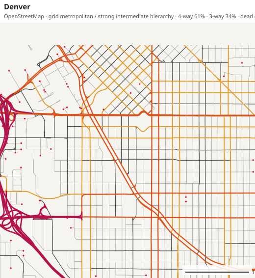
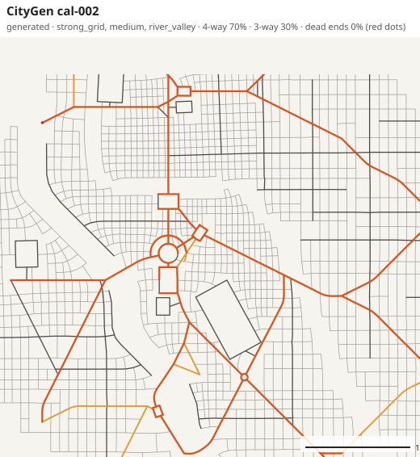
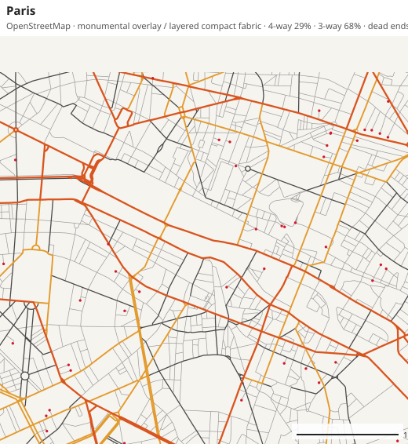
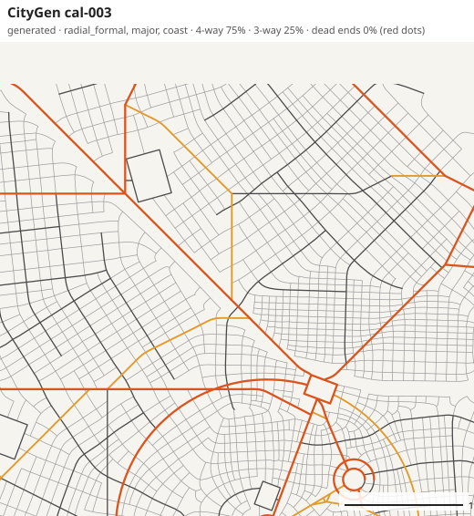

# Realism calibration report (V3.0 Alpha.2)

Measurement only. No generation rule was changed for this study; the generator is the V3.0
Alpha.1 generator. Every number below comes from
[calibration/DATA_TABLES.md](calibration/DATA_TABLES.md), which is rebuilt by
`node scripts/calibration-report.mjs`. Data extracted 2026-10-04.

There is no overall realism score. Each finding names a metric, a scale and the reference cities
that expose it.

## 1. What was measured

**Reference corpus: 8 real cities**, OpenStreetMap via OSMnx 2.1.1, drivable streets without
service roads, projected to UTM. Each is measured by the same code as a generated plan.

| City | Calibration archetype | Boundary | Network area | District windows | Neighbourhood windows |
|---|---|---|---|---|---|
| Denver | GRID_METROPOLITAN | 18 km window | 295 km² | 25 | 540 |
| Barcelona | GRID_METROPOLITAN (+ FORMAL_PLANNED) | municipality | 86 km² | 9 | 153 |
| Seville | COMPACT_CONTINENTAL | 14 km window | 122 km² | 11 | 207 |
| Palermo | COMPACT_CONTINENTAL | 16 km window | 120 km² | 11 | 211 |
| Paris | COMPACT_CONTINENTAL (+ FORMAL_PLANNED) | municipality | 94 km² | 9 | 163 |
| Helsinki | GEOGRAPHIC_FRAGMENTED | 16 km window | 133 km² | 11 | 250 |
| Tirana | RADIAL_TRANSITIONAL | 12 km window | 101 km² | 9 | 185 |
| Nashville | RADIAL_AUTOMOTIVE | 20 km window | 296 km² | 33 | 550 |

FORMAL_PLANNED stays open for Washington and Canberra; Paris and Barcelona only contribute to it.

**Generated batch: 96 CityGen cities** (`scripts/calibration-batch.mjs`, seeds `cal-001` to
`cal-096`): 8 planning profiles × 12 seeds each, three terrain presets, three city sizes
(48 major, 29 medium, 19 small) with population at 0.7–1.3× the size default. Network area
5–71 km², median 31 km². A 6 km district window needs a city larger than most small and medium
plans: 33 of the 96 seeds have no district window, so district findings rest on the 63 larger
ones. Neighbourhood windows: 5,281 in total, 51 per seed at the median.

**Scales.** City = the whole network. District = 6 km windows, neighbourhood = 1.5 km windows,
half-overlapping, kept when at least half built-up. Every window is stored as a sample with an
id, bounds and a context label (central / inner / peripheral, and strong grid / mixed /
irregular). Percentiles P10, P25, median, P75, P90 are stored for every metric across windows,
and within each city for segment length, block area, block aspect and node degree.

**How to read "envelope".** The lowest to the highest of the eight reference cities. With eight
cities one outlier can stretch it, so each table also says how many of the eight lie below the
CityGen median.

### Checks on the instrument

- **Agreement with OSMnx.** On the same Tirana graph OSMnx's own statistics and CityGen's
  analyzer give streets per node 2.56 / 2.56, dead ends 24.6% / 25.3%, 4-way 6.2% / 6.4%,
  circuity 1.074 / 1.076, mean segment 104 m / 105 m. Barcelona's city-wide orientation order
  comes out at 0.13, close to the 0.108 published by Boeing (2019).
- **One reader bug fixed.** Two-way streets were de-duplicated by OSM id, which is unreliable on
  simplified graphs; they are now de-duplicated by end nodes and length (GraphML reader and the
  Python exporter). No metric definition changed. All reference and generated measurements were
  made after the fix.
- **Additions, not changes.** Percentile distributions, window samples and source metadata were
  added to the profile. Existing metric values are computed exactly as in Alpha.1.

### Caveats that affect interpretation

1. **Divided roads.** OSM draws a dual carriageway as two lines. That splits one real 4-way
   junction into several 3-way nodes and creates thin faces between the carriageways. Real
   4-way shares are therefore understated and small "blocks" overstated. Block findings below
   use only faces of 0.3 ha or more for that reason.
2. **Window edges.** Streets cut by the extraction boundary end in artificial dead ends. Central
   and inner neighbourhood windows do not touch the boundary, so dead-end findings are read
   from those.
3. **Road classes are tags.** Mappers differ. Palermo has few primary / secondary tags and one
   very long ring road, so it is an outlier on every class-share metric. Tier shares are also
   reported with adjacent classes combined.
4. **Size.** Reference extracts are 2–9 times larger than a generated city. Metrics normalised by
   area are comparable; corridor length in km and anything involving motorways are less so.
5. **Eight cities** are a first control group, not a population. "Outside all eight" is strong
   evidence; "inside the envelope" is weak evidence when one city defines the edge.

## 2. Results at a glance

CityGen median against the eight reference cities. Full tables for all 26 metrics at all three
scales are in the data tables.

| Metric | CityGen P10 – median – P90 | Reference low–high (median) | Reference cities below CityGen | Where it shows |
|---|---|---|---|---|
| 4-way intersections | 51 – **68** – 76 % | 6–39 % (20) | 8 of 8 | every scale |
| 3-way intersections | 24 – **31** – 47 % | 52–75 % (66) | 0 of 8 | every scale |
| Dead ends | 0.1 – **0.2** – 0.9 % | 5.6–25.3 % (12.9) | 0 of 8 | every scale |
| Streets per node | 3.49 – **3.67** – 3.75 | 2.56–3.24 (2.92) | 8 of 8 | every scale |
| Roads above local, share of length | 20.8 – **23.7** – 31.7 % | 28.4–51.0 % | 0 of 8 | every scale |
| Middle tier (avenue + connector) | 7.7 – **14.0** – 16.7 % | 17.9–27.5 % | 0 of 8 | every scale |
| Major-road spacing | 712 – **1222** – 1469 m | 374–1777 m (579) | 7 of 8 | city, district |
| Orientation order | 0.10 – **0.70** – 0.85 | 0.01–0.81 (0.06) | 7 of 8 | every scale |
| Block aspect ratio (≥ 0.3 ha) | 1.40 – **1.45** – 1.51 | 1.57–2.02 | 0 of 8 | every scale |
| Segment length P75/P25 | 1.66 – **1.77** – 1.94 | 2.24–5.63 | 0 of 8 | within city |
| Circuity | 1.016 – **1.026** – 1.067 | 1.030–1.084 (1.059) | 0 of 8 | every scale, small gap |
| Intersection density | 61 – **77** – 86 /km² | 30–114 (67) | 5 of 8 | not biased |
| Street density | 11.8 – **14.8** – 16.4 km/km² | 9.4–16.7 (12.8) | 5 of 8 | not biased |
| Segment length, median | 82 – **88** – 93 m | 54–127 m (75) | 6 of 8 | not biased |
| Block area, median | 0.67 – **0.90** – 1.05 ha | 0.53–2.60 (0.95) | 3 of 8 | not biased |
| Major-corridor continuity | 0.36 – **0.54** – 0.84 | 0.22–0.90 (0.33) | 7 of 8 | not low |

The good news is in the bottom rows: how much street there is, how often streets meet, how long
a typical segment is and how big a typical block is are all inside real ranges. The generator's
problems are in *how* streets meet, *which* streets matter, and how *uniform* everything is.

## 3. The hypotheses

### H1. Too many 4-way intersections: **confirmed**

- City scale: CityGen median 68% (P10 51%). The highest reference city is Denver at 39%; the
  median reference city has 20%. No generated city is inside the envelope.
- Neighbourhood scale: CityGen median window 68% against 5–34% for the reference cities' median
  windows. Even the gridiest tenth of all real windows stops at 44%.
- The gap narrows but does not close against real grid cores: central Denver windows 58%,
  central Barcelona 49%, CityGen central 73%.
- The gentlest brief still overshoots: the `organic` profile gives 54%, small cities 52%.
- Caveat 1 lowers real values somewhat. It does not explain a 68% against 20% difference, and
  streets per node (3.67 against at most 3.24) tells the same story.

### H2. Too few dead ends: **confirmed**

- CityGen 0.2% (P90 0.9%). Reference cities 5.6–25.3%.
- Read from windows that cannot be affected by the extraction boundary: central windows have
  2.4% (Paris), 3.2% (Barcelona), 3.3% (Denver) and 8–16% elsewhere; inner windows 4.7–27%.
  CityGen has 0.0% in every ring.
- Real dead-end share is strongly archetype-dependent: about 3–8% in compact and grid fabric,
  15–30% in fragmented, automotive and informally grown fabric. A single target would be wrong.

### H3. Major roads too far apart: **confirmed, with one outlier against**

- CityGen median 1222 m. Seven of eight reference cities are between 374 m and 840 m; Palermo is
  at 1777 m because of its tagging (caveat 3).
- It worsens with city size: small 712 m, medium 1087 m, major 1374 m. Real spacing does not
  grow with city size in this corpus (Denver 630 m, Nashville 782 m at about 295 km²).
- Same picture at district scale (1373 m against 409–723 m outside Palermo) and neighbourhood
  scale (1362 m against 433–820 m outside Palermo). One generated neighbourhood in ten has
  spacing over 3 km, meaning almost no major road at all.

### H4. Too little middle hierarchy: **confirmed, but the gap is one tier higher than assumed**

- The connector tier alone is fine: 11.6% against 10.1–18.7%.
- The tier above it is missing: avenue share 1.7% against 5.2–14.0%; no generated city is
  inside the envelope.
- Combined, to be robust against tagging: middle tier (avenue + connector) 14.0% against
  17.9–27.5%, below all eight. Everything above local 23.7% against 28.4–51.0%, below all eight.
  Local streets are 76% of length against 49–72%.
- So Alpha.1's promotion filled the lower middle. What real cities have and CityGen lacks is a
  dense mesh of secondary avenues between the arterials.

### H5. Too little variance: **confirmed for individual elements and fabric type; rejected for density**

Confirmed:

- Segment lengths within a city: P75/P25 of 1.77 against 2.24–5.63. Below all eight.
- Block areas within a city (≥ 0.3 ha): P75/P25 of 2.34 against 2.83–4.13 in seven cities
  (Denver, a near-uniform grid, is 1.46).
- Block shape: median aspect ratio 1.45 against 1.57–2.02, 75th percentile 1.73 against
  2.12–2.95. Generated blocks are squarer and more alike than any real city's.
- Fabric type: 72% of generated neighbourhood windows are strong grids, 1% irregular. Outside
  Denver (87%), real cities have 2–24% strong-grid windows and 7–39% irregular ones.
- Hierarchy mix between neighbourhoods: the major-road share varies by 10 points across a
  generated city's neighbourhoods, against 19–50 points in real cities.

Rejected:

- Density differences between neighbourhoods are realistic. Intersection density P90/P10 is 2.8
  against 2.0–8.7; median block area P90/P10 is 2.6 against 1.7–14; the 4-way share ranges over
  26 points against 10–52. CityGen already has a believable centre-to-edge gradient.

### H6. Corridor continuity is weak: **rejected**

- CityGen median 0.54. Seven of eight reference cities are between 0.22 and 0.35; only Palermo
  (0.90) is higher. The Alpha.1 value of 0.53 is not unrealistically low; if anything it is
  above typical.
- The move from 0.60 to 0.53 between Alpha and Alpha.1 is small against the spread between
  seeds (P10 0.36, P90 0.84) and should not be chased.
- The metric is normalised by the square root of area, which favours small cities (small 0.83,
  major 0.44). In kilometres, generated corridors are at the low end: 2.9 km against 2.4–9.9 km
  (median 3.3), with Denver and Nashville near 6 km. That is consistent with H3 rather than a
  separate problem: there are too few major roads, not too little continuity along them.
- The metric definition was not touched.

## 4. Findings by scale

**City-scale bias.** Road-class composition and spacing. The share of roads above local, the
avenue tier and major-road spacing are all outside or at the edge of the reference range, and
all get worse as the generated city gets larger. Regional roads make up 2.1% of length against
2.5–14.0%: generated regional roads stop at the city edge, while real cities have motorways and
trunk roads running through or around them.

**District-scale bias.** The same composition problem, plus one that only appears here:
regional roads are 0.0% of a typical generated district against 5–14% in seven of eight cities.
District windows also show the grid uniformity clearly (orientation order 0.73 against
0.05–0.19 outside Denver).

**Neighbourhood-scale bias.** Junction topology and sameness. This is where the 4-way and
dead-end gaps are largest (4-way at 2.0× the highest reference city), where three quarters of
windows are near-perfect grids, and where block shape is most uniform.

**Looks fine city-wide, not fine close up.** Orientation order is "inside the envelope" at
every scale only because Denver defines the top. At neighbourhood scale the other seven cities'
median windows are 0.19–0.36 and CityGen's is 0.79: real neighbourhoods are locally ordered but
not ruled, and CityGen's default neighbourhoods are ruled.

**Fine at every scale.** Intersection density, street density, mean and median segment length,
median block area, number of dominant orientations, corridor continuity.

## 5. Archetypes

Where the CityGen median falls against each archetype's range (city scale; ▲ above, ▼ below,
blank inside).

| Metric | GRID_METROPOLITAN | COMPACT_CONTINENTAL | GEOGRAPHIC_FRAGMENTED | RADIAL_TRANSITIONAL | RADIAL_AUTOMOTIVE |
|---|---|---|---|---|---|
| 4-way share | ▲ (30–39) | ▲ (13–25) | ▲ (22) | ▲ (6) | ▲ (19) |
| Dead ends | ▼ (7–8) | ▼ (6–19) | ▼ (20) | ▼ (25) | ▼ (17) |
| Major-road spacing | ▲ (528–630) | inside (374–1777) | ▲ (496) | ▲ (840) | ▲ (782) |
| Avenue share | ▼ (7.8–10.1) | ▼ (5.2–10.3) | ▼ (14.0) | ▼ (8.1) | ▼ (6.3) |
| Orientation order | inside (0.13–0.81) | ▲ (0.01–0.08) | ▲ (0.02) | ▲ (0.05) | ▲ (0.13) |
| Circuity | ▼ (1.032–1.058) | ▼ (1.030–1.084) | ▼ (1.068) | ▼ (1.076) | ▼ (1.060) |
| Block aspect ratio | ▼ (1.68–1.95) | ▼ (1.73–1.98) | ▼ (2.10) | ▼ (1.87) | ▼ (1.87) |
| Intersection density | inside | inside | ▲ (54) | ▲ (67) | ▲ (30) |
| Street density | inside | inside | ▲ (10.8) | ▲ (12.1) | ▲ (9.4) |
| Median block area | inside | inside | ▼ (1.07) | ▼ (0.99) | ▼ (2.60) |

By default CityGen is closest to GRID_METROPOLITAN and next closest to COMPACT_CONTINENTAL in
density and block size. It is furthest from RADIAL_AUTOMOTIVE and GEOGRAPHIC_FRAGMENTED, which
are sparser, looser and more broken than anything in the batch.

Planning profiles do move some metrics. At neighbourhood scale the `organic` profile reaches
orientation order 0.27 with 9% strong-grid windows, and `radial_formal` 0.54 with 38%: both
inside real ranges. So grid monoculture is mostly a bias of the default brief and of six of
the eight profiles, not an inability. No profile moves dead ends (0.0% in all eight), the 4-way
share below 54%, or block aspect ratio (1.42–1.50 in all eight). Those are structural.

## 6. Visual check

Same 4 km central window, same scale, same style; red dots are dead ends. All fourteen plots
are in [calibration/plots/](calibration/plots/).

| Real | Real | Generated | Generated |
|---|---|---|---|
|  |  |  |  |
|  |  |  |  |

What the plots add to the numbers:

- They agree with them. The generated plans are a fine, even mesh of grey local streets with a
  few orange arterials and no red dots. The real ones have coloured roads every few hundred
  metres, red dots throughout, and visibly mixed block sizes.
- Real arterials and avenues form a mesh. Generated arterials form a sparse web of links between
  anchors, with large cells of local grid between them. The spacing metric understates how
  different that looks.
- Generated arterials bend at junctions more than real ones, which run straight for kilometres
  in Denver, Barcelona and Paris. Corridor continuity did not flag this because the metric
  already chains through bends of up to 30°. Worth watching when H3 is fixed, not a separate
  metric change.
- No case was found where the metrics looked right and the plan looked wrong on a metric
  classed as "not biased".

## 7. Top confirmed biases

Only the four strongest. Circuity (1.026 against 1.030–1.084) is real but small and is likely to
move when biases 1 and 3 are addressed, so it is not listed separately.

### BIAS 1 — streets cross instead of ending

**Metrics:** 4-way share, 3-way share, dead-end share, streets per node.

**Scale:** every scale; largest at neighbourhood scale.

**How far outside:** 4-way 68% against at most 39% (1.7× the highest city; 2.0× at
neighbourhood scale). 3-way 31% against at least 52%. Dead ends 0.2% against at least 5.6%, and
0.0% against at least 2.4% in central windows. Zero of 96 seeds inside the envelope on any of
the four.

**Exposed most by:** RADIAL_TRANSITIONAL (Tirana: 6% 4-way, 25% dead ends) and
GEOGRAPHIC_FRAGMENTED. Still outside GRID_METROPOLITAN.

**Likely cause:** `StreamlineGrower` grows both street families as long continuous lines that
cross each other, so nearly every meeting is a crossing. `pruneDeadEnds` in `StreetPlanner` and
again in `BlockPlanner` removes every dangling street, and the validator counts a dead end as a
defect. Streets are cut short only by the `streetIrregularity` chance, and the stub is then
pruned.

**Later fix direction:** let a share of cross streets terminate at the first street they meet
and restart offset (T-junctions and staggered grids); stop pruning dead ends wholesale and keep
a controlled share, by district type and position (a few percent in central grids, far more in
peripheral, hillside and waterfront fabric); stop reporting an intended cul-de-sac as a warning.
Targets should be ranges per archetype, not one number.

### BIAS 2 — the avenue mesh is missing

**Metrics:** avenue share, middle-tier share, share of all roads above local, major-road
spacing, regional share; spread of major-road share between neighbourhoods.

**Scale:** city and district; at neighbourhood scale it shows as some neighbourhoods having no
major road at all.

**How far outside:** avenue tier 1.7% against 5.2–14.0%. Middle tier 14.0% against 17.9–27.5%.
Above local 23.7% against 28.4–51.0%. All three below all eight cities. Spacing 1222 m against
374–840 m in seven of eight, and 1374 m for the major size.

**Exposed most by:** GRID_METROPOLITAN (Denver, Barcelona: an avenue every 500–600 m) and
Helsinki and Paris; hidden only by Palermo's tagging.

**Likely cause:** major roads exist only where the demand graph links two anchors, so their
number follows the number of anchors, not the area of the city; the reinforcement budget is a
small fixed count per size (3 / 5 / 10 links). `HierarchyPlanner` can only promote what exists,
and its avenue rule (a long collector between two primary-or-better roads) rarely fires.
Regional roads are stepped down at the urban gateway and never pass through or around the city.

**Later fix direction:** give the plan an area-driven target for avenue spacing and fill it
with continuous cross-city lines, first by promoting existing straight collector and through
street chains, then by laying a small number of new ones where none exists; scale the
reinforcement budget with urban area; let at least one regional road continue as a bypass or
through route in larger cities.

### BIAS 3 — everything is the same size and shape

**Metrics:** segment-length spread, block-area spread, block aspect ratio and its spread.

**Scale:** within a city, element by element; visible in every neighbourhood window.

**How far outside:** segment length P75/P25 1.77 against 2.24–5.63 (below all eight). Block
area P75/P25 2.34 against 2.83–4.13 in seven of eight. Block aspect median 1.45 against
1.57–2.02 and 75th percentile 1.73 against 2.12–2.95 (below all eight). Typical sizes are
right; only the spread and the elongation are wrong.

**Exposed most by:** COMPACT_CONTINENTAL and GEOGRAPHIC_FRAGMENTED. Denver shows that a real
grid can be as uniform in block area as CityGen, but its blocks are still 2:1.

**Likely cause:** `DistrictPlanner` gives each district one block width and length, in a ratio
of about 1 : 1.5, and `StreamlineGrower` keeps streets at that separation with only a small
jitter, so blocks inside a district are near-copies. Sliver merging in `BlockPlanner` removes
the small end of the distribution.

**Later fix direction:** draw block length and width from a distribution within each district
rather than one value; make residential blocks longer relative to their width (2:1 to 3:1);
vary street spacing along a street; keep more small residual blocks. Check afterwards that the
medians, which are correct today, do not move.

### BIAS 4 — most neighbourhoods are ruled grids by default

**Metrics:** orientation order and entropy, share of strong-grid windows; circuity as a
side effect.

**Scale:** every scale; clearest at neighbourhood scale.

**How far outside:** orientation order 0.70 city-wide against at most 0.13 in seven of eight
cities (Denver 0.81). At neighbourhood scale 0.79 against 0.19–0.36 outside Denver. 72% of
generated windows are strong grids against 2–24% outside Denver.

**Exposed most by:** COMPACT_CONTINENTAL, RADIAL_TRANSITIONAL, GEOGRAPHIC_FRAGMENTED.
GRID_METROPOLITAN does not expose it at city scale, though Barcelona does at neighbourhood scale.

**Likely cause:** this one is mostly configuration. Regular street regimes share the city-wide
base orientation unless their arterials point clearly elsewhere, the default `gridPreference`
is 0.55, and `ORTHOGONAL` is the default regime for an ordinary flat district. The `organic`
and `radial_formal` profiles already land inside real ranges.

**Later fix direction:** let more districts keep their own orientation (the hard-seam mechanism
from Alpha.1 exists for this); make the default brief less ordered, or choose order per
district from a distribution; treat the grid as one archetype among several rather than the
baseline. Because a brief can already fix it, this is the cheapest of the four.

## 8. What not to tune

- Intersection density, street density, median segment length and median block area are
  already realistic. Fixes for biases 1–3 must not move them out of range.
- Density gradient from centre to edge is realistic.
- Corridor continuity needs no fix and its definition should stay as it is.
- The connector tier is already in range; it is the avenue tier above it that is empty.

## 9. Reproducing this study

```bash
python3 -m venv .venv && .venv/bin/pip install osmnx networkx geopandas shapely pandas numpy momepy
```

```bash
.venv/bin/python tools/reference/osmnx_to_reference.py --all --check
```

```bash
node scripts/realism.mjs reference --all
```

```bash
node scripts/calibration-batch.mjs --count 96
```

```bash
node scripts/calibration-report.mjs && node scripts/calibration-plots.mjs
```

The downloaded networks (`reference/networks/`, 18 MB) are not committed; the measured profiles
(`reference/profiles/`, 2.6 MB) are. OpenStreetMap data changes, so a later extraction will
differ slightly from the 2026-10-04 one; each profile records its extraction date, query,
filter and projection in `sourceMetadata`.

Data: © OpenStreetMap contributors, ODbL.
